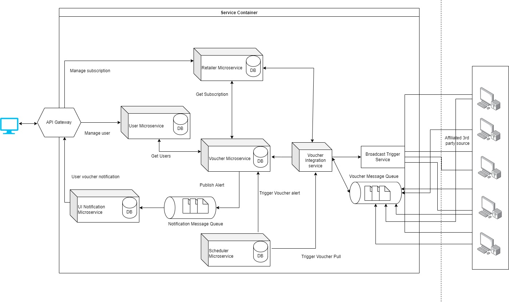
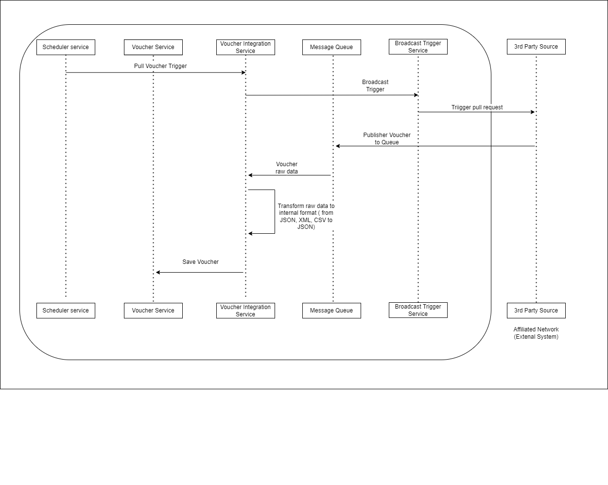
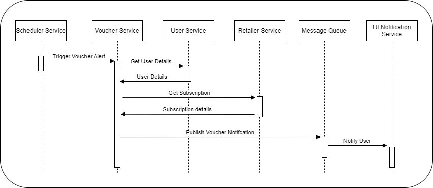

# Voucher Alert System
## Features
- Retailer Management
- Voucher Management
- User Management
- Scheduler -- With Timezone compatibility
- 3rd party Service call

## High level sercice required
- Retailers Service 
- Voucher Service 
- User Service
- Scheduler Service
- Notification Service
- GateWay Service
- Voucher Integration Service
- Notification Message Queue
- Voucher Message Queue

### High level Architecture diagram

### Voucher Pull Flow

### Voucher Alert Flow

### Retailers Service 
- Retailers Microservice -- Restful service
- RDB
### Voucher Service
- Voucher Microservice -- Restful service
- RDB 
### User Service
- USer Microservice -- Restful service
- RDB

### Scheduler Service
- Retailers Microservice -- Restful service
- RDB

### Notification Service
- UI Notification Microservice -- Restful service
### GateWay Service
### Voucher Integration Service
- Voucher Integration -- Service
- Transformation - Content from JSON, XML, CSV to JSON
### Notification Message Queue
- Message Queue -- Voucher Alert information
- RabbitMQ
### Voucher Message Queue
- Message Queue -- Voucher pull from 3rd part service (JSON, XML, CSV)
- RabbitMQ